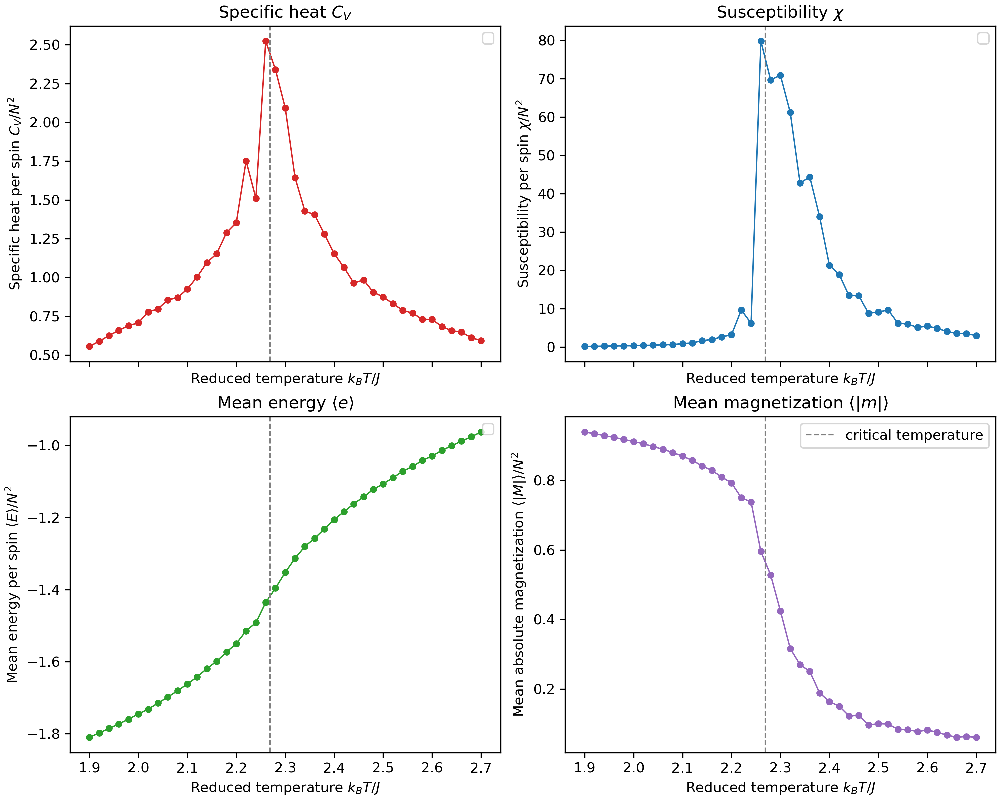
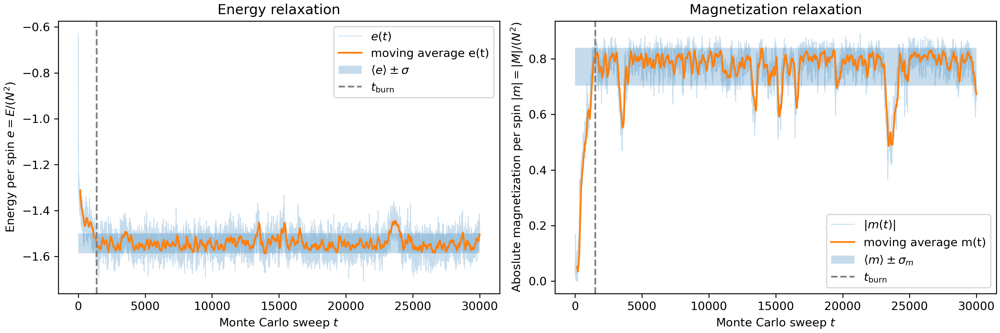
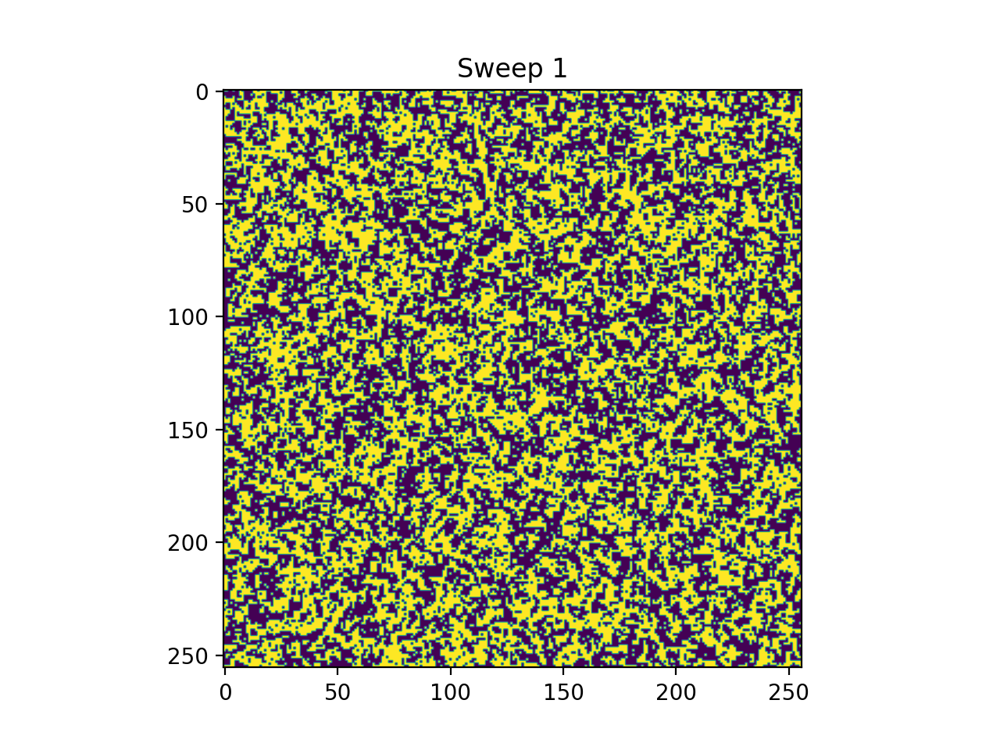

# Ising Model
This project simulates the 2 dimensional Ising model on a square lattice using the Metropolis algorithm.
It includes tools for temperature scans, equilibrium (burn‑in) estimation, and animations of the spin dynamics.

## Installation
Clone the repository and install dependencies:
```bash
git clone https://github.com/martintphh/IsingModel
cd IsingModel
pip install -r requirements.txt
```

## Usage
The project provides a command‑line interface that allows you to configure simulation parameters such as lattice size, temperature, number of sweeps, and more.

### Temperature Scan
This script runs the simulation over a range of temperatures.
For each temperature it computes:
- specific heat per spin
- susceptibility per spin
- mean energy per spin
- mean magnetization per spin

Example: temperature scan over [2.0, 2.2, 2.4, 2.6] on a 64×64 lattice:

```bash
python -m scripts.run_temperature_scan 2.0 2.2 64 --Tstep 0.2 --sweeps 30000 --burn_in 8000             
```
#### Example of a temperature scan



### Equilibrium
For MCMC alghoritm such as the implemented Metropolis algorithm it is common that the simulation needs a number of steps till it reaches a state of equlibibrium. Physically, this corresponds to the thermodynamic equilibrium. The steps needed to reach such a state are called burn in. This script provides a way to estimate the burn in needed for the system to reach a stable state. Running the script also provides plots of the energy per spin and the magnetization per spin over the MC sweeps.

You can run the script with following code example using a 64x64 lattice at temperature 2.2

```bash
python3 -m scripts.run_find_equilibrium 64 2.2 --sweeps 30000 --save_as burn_in_N64 
```
#### Example of equilibrium run



### Animation
This script generates an animation of the spin configuration over time.

A simulation on a 64x64 grid at temperature 1.0 can be animatied by
```bash
    python3 -m scripts.run_animation 80 2.2 --sweeps 1000 --save_every 10 --save_as ising_T22
```

#### Example of animation run



##License

MIT License © 2025 Martin Tinhof